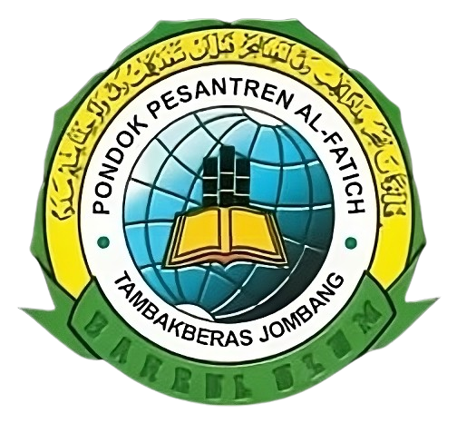

 

<h3 align="center">Al Fatich II</h3>

Website Pondok Pesantren Al Fatich II Tambak Beras Jombang Jawa Timur
 

## Tentang Project Ini

Pada project ini kami selaku developer akan membangun sebuah website pondok pesantren yang bernama Pondok Pesantren Al-Fatich II yang beralamatkan di Tambakberas Jombang JawaTimur.

Project ini kami kembangkan menggunakan framework `Laravel 11`, dengan framework css `bootstrap, dan TailwindCss`

-   [Laravel](https://laravel.com)

-   [Tailwind](https://tailwindcss.com)
-   [Bootstrap](https://bootstrap.com)

## License

Distributed under the MIT License. See [MIT License](https://opensource.org/licenses/MIT) for more information.

## Kontak

Tim Developer - [@Tim_IT_Al_Fatich_II](https://alfatich.my.id) - @alfatich.my.id
